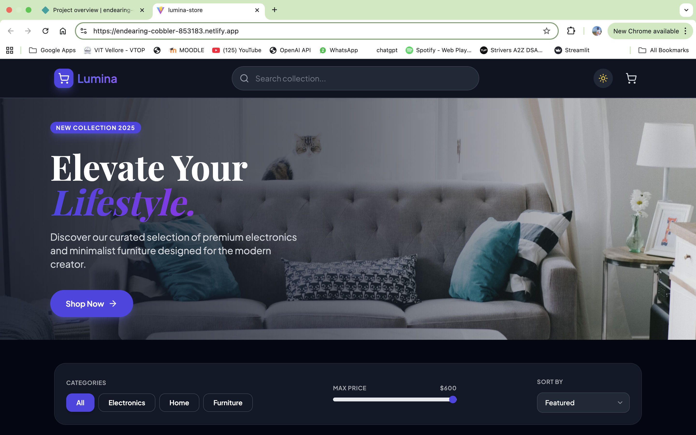
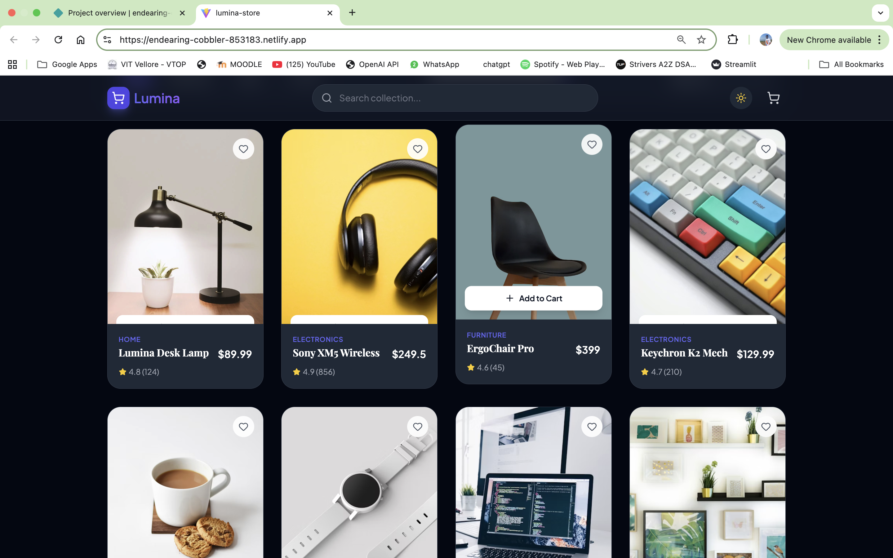
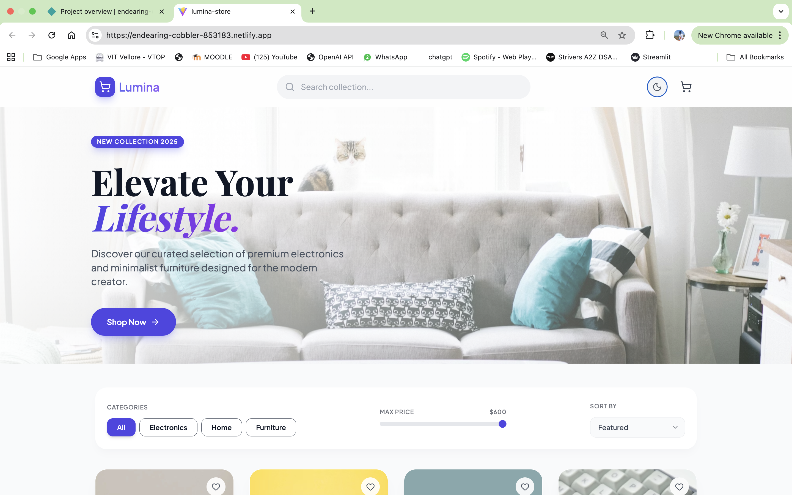
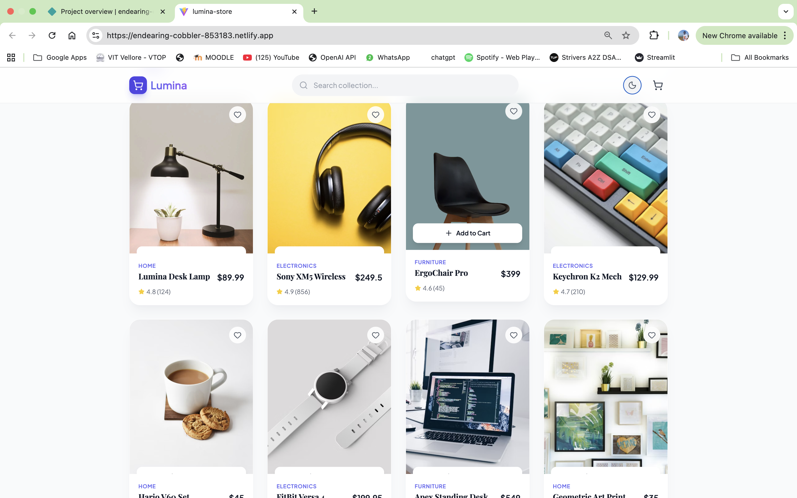

 Lumina Store - Modern E-Commerce Dashboard

A high-performance, responsive e-commerce application built with React and Tailwind CSS. This project demonstrates modern frontend practices including state management, persistent local storage, and advanced UI/UX patterns like skeleton loading and dark mode.

 Live Demo

[https://endearing-cobbler-853183.netlify.app/]

 Key Features (Bonus Challenges Implemented)

 UI/UX Excellence:

Skeleton Loading State: Simulates API latency with shimmering placeholders to prevent layout shift (CLS) and improve perceived performance.

Dark/Light Mode: System-aware theming using Tailwind's dark mode capabilities, persisted via local storage.

Glassmorphism Design: Modern, translucent UI elements for the navbar and modals.

Responsive Hero Section: A visual-first entry point with smooth scroll interactions.

 Advanced Cart Logic:

Promo Code System: Functional discount logic (Try code: LUMINA10).

Free Shipping Meter: Gamified progress bar incentivizing users to increase cart value.

Persistent Cart: Cart state survives page reloads using a custom useLocalStorage hook.

 Interactive Elements:

Quick View Modal: Allows users to view product details and select variants (Color/Size) without leaving the catalog.

Toast Notifications: Custom-built notification system for user feedback (Add to cart, Wishlist updates).

Multi-Step Checkout: A realistic checkout form with validation and simulated payment processing states.

Tech Stack:

Core: React 18 (Vite)

Styling: Tailwind CSS + Custom Animations

Icons: Lucide React

State Management: React Hooks (useState, useEffect, useMemo) + Custom Hooks

Data Source: Local Mock JSON with support for product variants

 Setup & Installation:

Clone the repository

git clone [https://github.com/Surya-j2004/lumina-store.git]
cd lumina-store

Install Dependencies

npm install

Run Locally

npm run dev

 Design Decisions & Assumptions:

Modular Architecture: The codebase is split into components/, hooks/, and data/ to ensure scalability and maintainability.

Local Storage: Since no backend was provided, localStorage is used to simulate a database for the Cart, Wishlist, and Theme settings.

Performance: useMemo is heavily utilized for filtering and sorting logic to prevent unnecessary re-renders during search operations.

Screenshots:

Light Mode:

Dark Mode:

Built for the Frontend Coding track by [Jonnagadla Surya]
